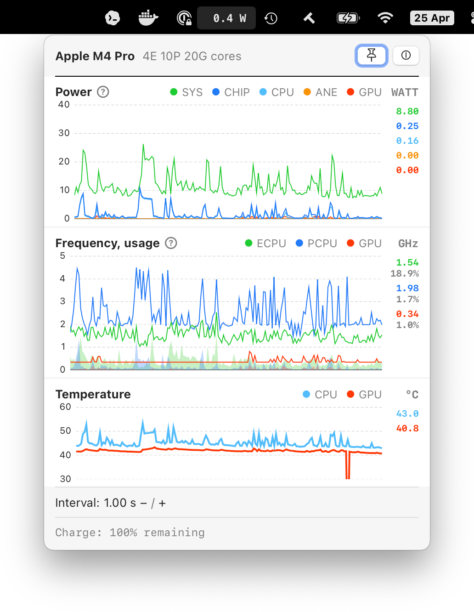

# StillCore

StillCore is a macOS menu bar utility for Apple Silicon metrics. It shows live charts for SoC power, temperature, frequency, and usage, and includes an optional background helper for tracking battery usage sessions.



## Requirements

- macOS 14 or newer
- Apple Silicon Mac

## Build And Run

Building from source requires Xcode with Swift 6 support and network access for Swift Package dependencies.

Build the debug app:

```sh
make app
```

The app bundle is written to:

```text
.build/Build/Products/Debug/StillCore.app
```

Build and run from the terminal:

```sh
make run
```

Build and open the app bundle:

```sh
make open-app
```

Remove build artifacts:

```sh
make clean
```

## Release Build

Release builds require Apple Developer signing credentials and a notarytool profile.

Create a signed, notarized DMG:

```sh
make release DEVELOPMENT_TEAM=<team-id>
```

`make release` builds the Release configuration, signs with `Developer ID Application`, creates `StillCore.dmg`, submits it for notarization, staples the notarization ticket, validates the result, and prints the final artifact path.

The DMG contains `StillCore.app` and an `Applications` symlink for drag-to-install.

The default notarytool keychain profile is:

```text
StillCore-Notarization
```

Create the profile once before running `make release`:

```sh
xcrun notarytool store-credentials "StillCore-Notarization" --apple-id "<apple-id>" --team-id "<team-id>"
```

`notarytool` prompts for the app-specific password and stores the credentials in Keychain. To use a different profile name, pass `NOTARY_PROFILE=...`:

```sh
make release DEVELOPMENT_TEAM=<team-id> NOTARY_PROFILE=<profile-name>
```

## Development Commands

Build with the local workspace and local `macmon` xcframework:

```sh
LOCAL=1 make app
```

Build with an explicit workspace override:

```sh
WORKSPACE=<workspace-name> make app
```

Rebuild the app and restart the battery helper if it is already registered:

```sh
make helper-restart
```

Launch Instruments Time Profiler for a Release build:

```sh
make profile
```

Run chart benchmarks:

```sh
make benchmarks
```
